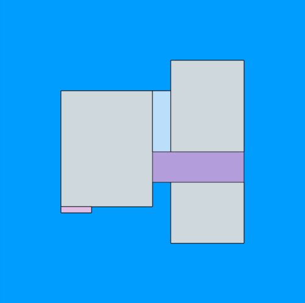

# Planview

HTML5 Canvas based library for generating and rendering diagrams.

[](https://www.npmjs.com/package/planview)

[](https://github.com/nihalvaria/planview)

## Generating plan with points relative to image size.

The [relative_points](./demo/sources/relative_points.js) file can be found in the sources folder. It contains the config and the sections to be rendered.

```html
<body>
    

    <script type="module">
        import { generateDiagram } from '../dist/planview.esm.js';
        import { relative_points } from './sources/relative_points.js';

        const img1 = document.getElementById('img-1');
        img1.src = generateDiagram(relative_points).diagram;
    </script>
</body>
```

The output of the above is following :


